# 如何攻破网站
- 2015 如何进行合适的和可攻击

## Who am I 
* 杰森
* Bugcrowd
* 技术运营总结
* 和可和漏洞猎人
* 在空前的排行榜上 bugcrowd 2014


## 哲学


与标准测试的差异single-sourcedCrowdsourced
 
* 主要查找常见的漏洞
* 不与他人竞争
* 计数激励
* 基于嗅探测试的付款
* 查找不太容易找到的 vulns
* 比赛时间
* 竞争对手与其他人
* 激励查找唯一的 bug
* 基于的付款
* 影响不是结果的数量


## 常规方法

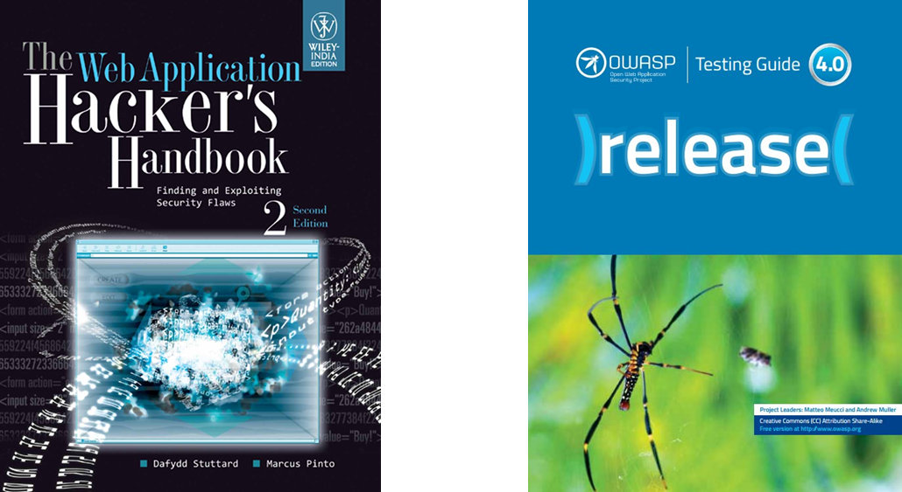

意味着查找应用程序（或应用程序的一部分）较少测试。
1. \*.acme.com 范围是您的朋友
2. 通过 Google (和其他用户) 查找域
a. 通过侦察和其他工具可以很好地实现自动化.
3. 对模糊的 web 服务器或服务进行端口扫描 (在所有域上)
4. 查找收购和赏金收购规则
a. Google 有6月的规则
5. 功能更改或设计
6. 移动网站
7. 新的移动应用程序版本

工具: recon-ng script (enumall)

https://github.com/jhaddix/domain

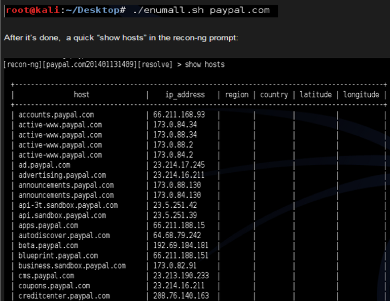 

GoogleHack

 


 
### 端口扫描

端口扫描不仅适用于Netpen！
所有新建目标的完整端口扫描通常会产生#win：
* 分开的Web应用程序
* 无关的服务
* Facebook的Jenkins脚本控制台没有认证
* IIS.net的rdp打开容易受到MS12\_020的影响

```
nmap -sS -A -PN -p- --script = http-title dontscanme.bro
^ syn scan，OS +服务指纹，没有ping，所有端口，http标题
```

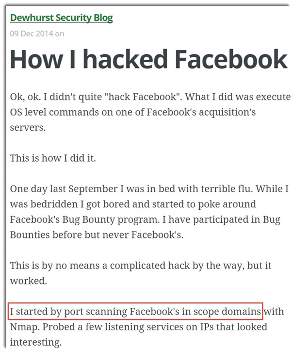 

### 文件目录

目录猜解
1. RAFT列表（包含在Seclists中）
2. SVN挖掘者（包含在Seclists中）
3. Git挖掘机
4. 平台识别：
5. Wapplyzer（Chrome）
6. Builtwith（Chrome）
7. retire.js（cmd-line或Burp）
8. 检查CVE的
9. 辅助
10. WPScan
11. CMSmap

目录Bruteforce工作流程

暴力破解之后，查找其他状态代码，指出您被拒绝或需要身份验证，然后附加列表，以测试配置错误的访问控制。

例：
GET http://www.acme.com - 200<br/>
GET http://www.acme.com/backlog/ - 404<br/>
GET http://www.acme.com/controlpanel/ - 401<br/>
http://www.acme.com/controlpanel/[bruteforce]

使用OSINT映射/ Vuln发现
查找以前/现有的问题：
#### OSINT
>公开资源情报计划（Open source intelligence 
>
>），简称OSINT，是美国中央情报局（CIA）的一种情报搜集手段，从各种公开的信息资源中寻找和获取有价
>
>值的情报

1. Xssed.com
2. Reddit XSS - /r/xss
3. Punkspider
4. xss.cx
5. xssposed.org
6. twitter searching
7. ++

问题可能已经报告，但使用缺陷区域和注入类型来指导您进一步注射或过滤旁路

新项目：Maps
新的OSINT / Mapping项目
* 250+赏金计划
* 抓取
* DNS信息+暴力
* 元数据（链接，奖励，范围）
* API - >阴谋

http://github.com/bugcrowdlabs/maps

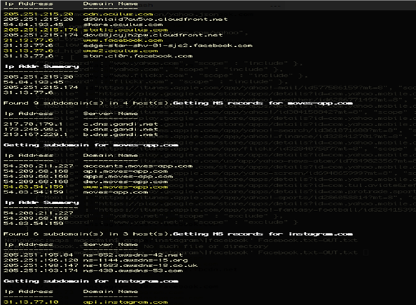

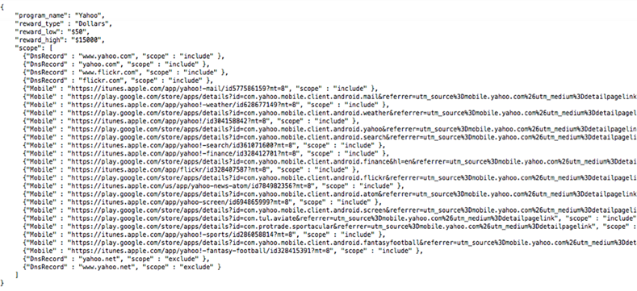 


使用地图项目：爬网
使用+ Ruby + Anemone + JSON + Grep

```
$ cat test_target_json.txt | grep redirect https：// test_target / redirect /？url = http：//twitter.com / ... https：// test_target / redirect /？url = http：//facebook.com / ... https：//test_target/重定向/ URL= HTTP：//pinterest.com/...
```

新工具：Intrigue
OSINT框架，简单的整合。特征：

* DNS子域名暴力破解
* Web爬取
* Nmap扫描
* 等
代码@ http://github.com/intrigueio/intrigue-core

### 认证（最好快）
Auth相关（更多在逻辑，priv和传输部分）
1. 用户/传递差异缺陷
2. 注册页面收集
3. 登录页面收获
4. 密码重置页面收获
5. 没有帐户锁定
6. 弱密码策略
7. 帐户更新不需要密码
8. 密码重置令牌（无过期或重复使用）

#### 会话（最好最快）
会话相关
1. 未能使旧的Cookie无效
2. 登录/注销/超时没有新的cookie
3. 永不结束cookie长度
4. 允许多个会话
5. 易于翻转的cookie（最常用的是base64）


### XSS

核心理念:页面功能是否向用户显示某些内容？
对于时间敏感测试, 80/20 规则适用。许多测试人员使用多的有效载荷。
你可能也有!

```
';alert(String.fromCharCode(88,83,83))//';alert(String. fromCharCode(88,83,83))//";alert(String.fromCharCode
(88,83,83))//";alert(String.fromCharCode(88,83,83))//--
    ></SCRIPT>">'><SCRIPT>alert(String.fromCharCode(88,83,83)) </SCRIPT>
    Multi-context, filter bypass based polyglot payload #1 (Rsnake XSS Cheat Sheet)
    '">><marquee></marquee>"
    ></plaintext\></|\><plaintext/onmouseover=prompt(1)
    ><script>prompt(1)</script>@gmail.com<isindex formaction=javascript:alert(/XSS/) type=submit>'-->" ></script><script>alert(1)</script>">'">
    Multi-context, filter bypass based polyglot payload #2 (Ashar Javed XSS Research)
    “ onclick=alert(1)//<button ‘ onclick=alert(1)//> */ alert(1)//
    Multi-context polyglot payload  (Mathias Karlsson)
```
其他XSS

SWF Parameter XSS<br/>
常用参数:<br/>
onload, allowedDomain, movieplayer, xmlPath, eventhandler, callback(更多在 OWASP 页)

常用的注入字符串:

```
    \%22})))}catch(e){alert(document.domain);}//
    "]);}catch(e){}if(!self.a)self.a=!alert(document.domain);//
    "a")(({type:"ready"}));}catch(e){alert(1)}//
```

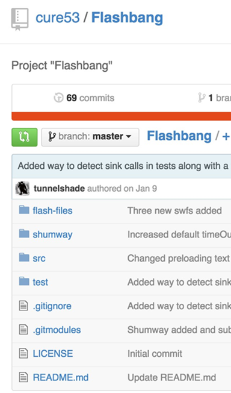 

输入向量
* 通过CSS 定制主题&配置文件
* 时间或会议名称
* 基于URI 
* 从第三方进口
* JSON POST 值(检查返回内容类型)
* 文件上传名称
* 上层的文件(swf, HTML, ++) 
* 自定义错误页
* 假参数 - ?realparam=1&foo=bar'+alert(/XSS/)+'
* 登录和忘了密码菜单


## SQL 注入
核心理念:页面看起来像可能需要对存储的数据进行调用吗？
存在一些 SQLi polyglots;

```
SLEEP(1) /*‘ or SLEEP(1) or ‘“ or SLEEP(1) or “*/
```

在单引号上下文中工作, 在双引号上下文中工作, 
在 "直接进入查询" 上下文中工作! (克尔卡尔森)


您还可以利用Seclist 中的fuzzlists :

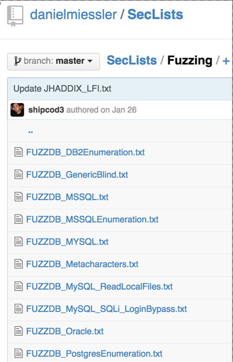

SQL 注入观测

盲目是主要的, 基于错误是极不可能的。
```
‘%2Bbenchmark(3200,SHA1(1))%2B’
‘+BENCHMARK(40000000,SHA1(1337))+’
```

常用的参数或注入点
1. id
2. 货币值
3. 物料编号值
4. 排序参数(如订货,排序等)
5. JSON 和XML 值
6. Cookie 值
7. 自定义标题(寻找可能的集成与CDN的或WAF 的）
8. 基于REST 服务

使用-l 来分析burp日志文件.
使用篡改脚本用于黑名单
Burp的SQLiPy 插件能很好地 SQLmap 快速检测.
大量的网络服务注入

 

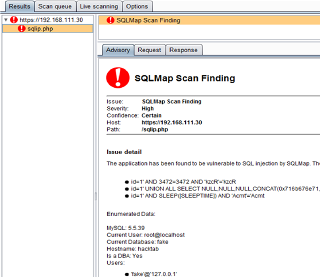 

最佳SQL 注入资源

mySQL
- PentestMonkey's mySQL injection cheat sheet
- Reiners mySQL injection Filter Evasion Cheatsheet


MSSQL 
- EvilSQL's Error/Union/Blind MSSQL Cheatsheet
- PentestMonkey's MSSQL SQLi injection Cheat Sheet

ORACLE
- PentestMonkey's Oracle SQLi Cheatsheet

POSTGRESQL
- PentestMonkey's Postgres SQLi Cheatsheet

Others 
- Access SQLi Cheatsheet
- PentestMonkey's Ingres SQL Injection 
- Cheat Sheet pentestmonkey's DB2 SQL Injection Cheat Sheet pentestmonkey's 
- Informix SQL Injection Cheat Sheet
- SQLite3 Injection Cheat sheet
- Ruby on Rails (Active Record) SQL Injection Guide


### 本地文件包含
核心理念:它 (或可以) 与服务器文件系统进行交互吗？

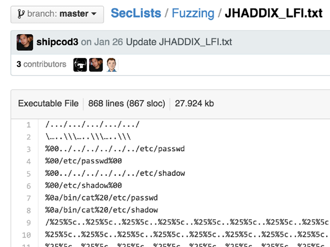

常用参数或注入点
1. file=
2. location= 
3. locale=
4. path= 
5. display=
6. load=
7. read=
8. retrieve= 

攻击:
* 上传意外的文件格式以实现代码(swf、html、php、php3、aspx、++) Web shell 或...
* 通过相同类型的文件执行 XSS。图像 Webshell!
* 通过将有效负载存储在元数据或文件头中来攻击解析器以 DoS 站点或 XSS
* 绕过安全区域并通过文件 polyglots 在目标站点上存储恶意软件
* 文件上传攻击是一个完整的演示文稿。尝试这一个, 以获得旁路技术的感觉:
* 内容类型欺骗
* 扩展技巧
* 文件在漏洞!  http://goo.gl/VCXPh6

### 远程文件包含和重定向

查找带有其他 web 地址的任何参数。同样的参数从 LFI 也可以在这里出现。

常见黑名单绕过
* escape  "/" with "\/" or “//” with “\/\/”
* try single "/" instead of "//" 
* remove http i.e. "continue=//google.com" 
* “/\/\” , “|/” , “/%09/”
* encode, slashes
* ”./” CHANGE TO “..//”
* ”../” CHANGE TO “….//”
* ”/” CHANGE TO “//”


|常见参数 |- |
|File= | document=
|Folder= | root=
|Path= | pg=
|style= |pdf=
|template= |
|php_path= |
|doc= |

### CSRF 

每个人都知道 CSRF, 但这里的 TLDR 是找到敏感的功能, 并试图 CSRF。
Burp CSRF PoC 是快速和容易的:
许多网站将有 CSRF 保护, 重点 CSRF 旁路!

 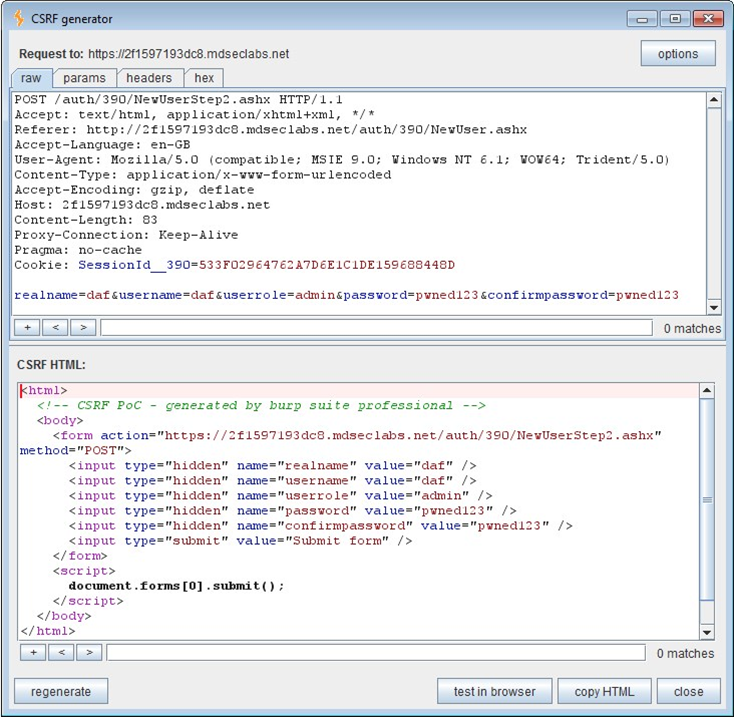 

常见旁路:
* 从请求中删除 CSRF 标记
* 删除 CSRF 标记参数值
* 将错误的控制字符添加到 CSRF 参数值
* 使用第二个相同的 CSRF 参数
* 更改投递到

Debasish "编写了一个 python 工具来自动查找称为 CSRF 的旁路Burpy.
步骤 1: 启用Burp记录。用Burp来抓取一个完全执行所有功能的站点。
步骤 2: 创建模板..。

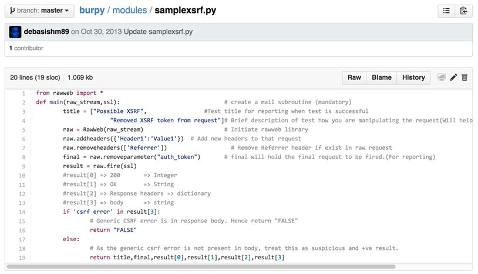

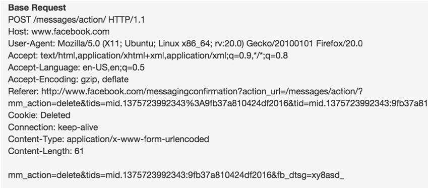

 


|CSRF 常见的关键功能|
|添加/上传文件| 密码更改
|电子邮件更改| 转移货币
|删除文件 | 配置文件逻辑

### 越权

通常, 逻辑、权限、身份验证错误都是模糊的。                      
测试用户权限 
Privilege 特权
1. admin 有权限
2. peon 没有
3. peon 可以调用只有admin 才能调用的功能

常用函数或视图
1. 添加用户函数
2. 删除用户函数
3. 启动项目/市场活动/等功能
4. 更改帐号信息(传递，槽送等）功能
5. 客户分析视图
6. 付款处理视图
7. 任何带有PII 的视图

查找受限于特定用户类型的网站功能
2. 尝试使用较小的/其他用户角色访问这些函数
3. 尝试以较小的 priv.edb 用户的方式直接浏览到带有敏感信息的视图
Autorize Burp插件是相当整洁这里..。
https://github.com/Quitten/Autorize

 


不安全的直接对象引用
idors在资源共同的地方，很难用扫描仪捕捉到。
找到所有的UID
* 增量
* 减量
* 负值
* 尝试执行敏感函数取代另
一个UID
* 取代另一个UID
* 更改密码
* 忘记密码
* 管理员功能

常用函数，视图或文件
CSRF表中的所有内容，尝试跨账户攻击
子: uid, 用户哈系或电子邮件
非公开图像
收据
专用文件(pdf, ++)
发货信息& 采购订单
发送/删除邮件


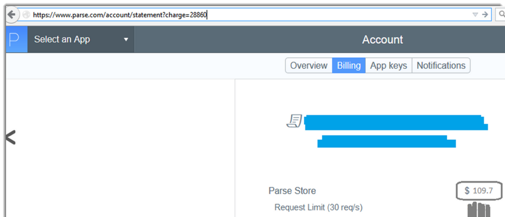

### 传输
大多数安全相关站点将启用 HTTPs。这是你的工作, 以确保他们已经做到了无处不在。大多数时候, 他们错过了什么。

例子:

通过 HTTP 传输的敏感图像

通过HTTP 泄漏会话数据/PII 的分析

https://github.com/arvinddoraiswamy/mywebappscripts/tree/master/ForceSS


### 逻辑
复杂的逻辑缺陷, 大多是手动的:

* 用散列参数
* 步骤操作
* 在数量上使用否定词
* 认证bypass
* 应用层DoS
* 定时攻击

常见的移动应用程序不应用查找未加密的 PII 的常用位置
1. 系统日志(利用所有应用程序)
2. webkit的缓存(cache.db)
3. plists, DBS 等
4. 硬编码的二进制文件

Quick spin-up for IOS

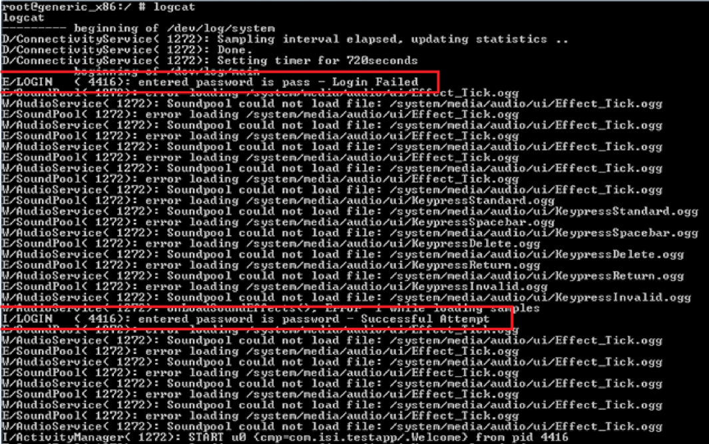 

### 信息泄漏

以前被称为 "噪音"
内容欺骗或 HTML 注入
引用泄漏
安全标头
路径泄漏
点击劫持
++

数据驱动的评估(递减返回 FTW)

1. 访问搜索、注册、联系人、密码重置和注释表单, 并使用您的多字符串对它们进行攻击
2. 使用打嗝内置扫描仪扫描这些特定功能
3. 检查你的cookie, 注销, 检查cookie, 登录, 检查cookie。提交旧的 cookie, 查看是否访问。
4. 对登录、注册和密码重置执行用户枚举检查.
5. 执行重置并查看是否; 密码来明文、使用基于 URL 的标记、可预知、可多次使用或自动登录
6. 在 url 的任何位置查找数字帐户标识符并为上下文更改旋转它们
7. 查找安全敏感函数或文件, 查看是否易受非授权浏览 (idors)、低授权浏览、CSRF、CSRF 保护旁路, 并查看它们是否可以通过 HTTP 完成.
8. SecLists 上的顶部短列表的目录蛮力
9. 检查可执行代码的替代文件类型的上载功能 (xss 或 php/etc)

